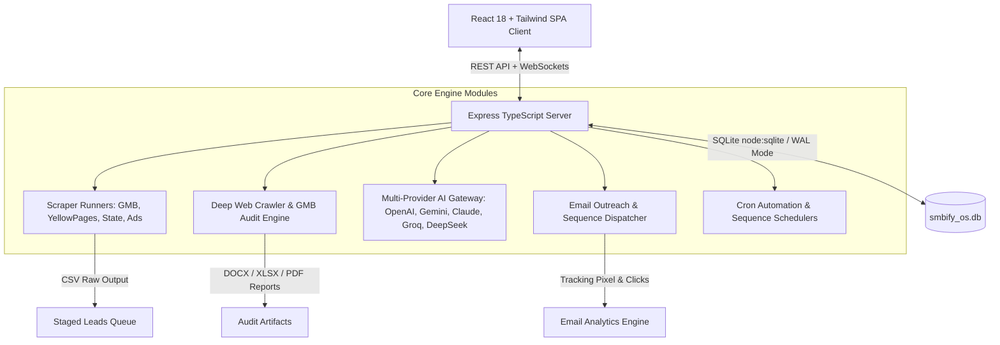
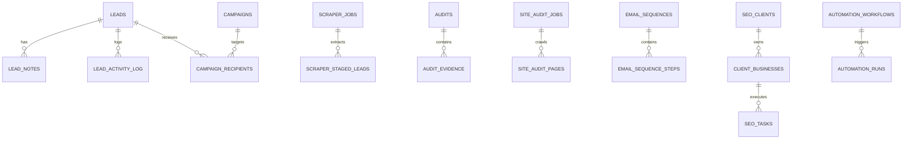
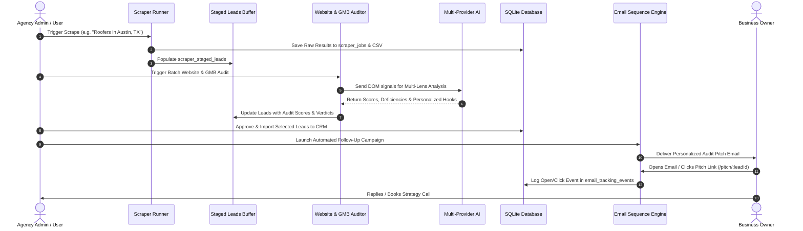
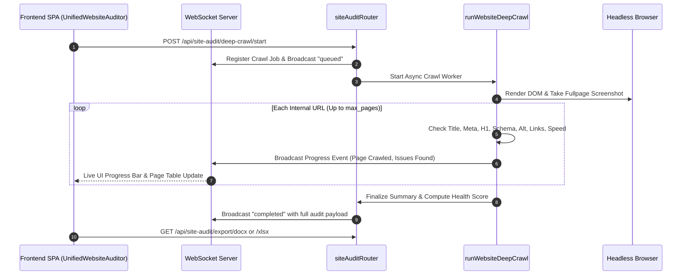

# 🚀 SMBify OS — Comprehensive Architecture & Technical Documentation

> **SMBify OS** is an enterprise-grade, all-in-one platform built for Digital Marketing Agencies, Local SEO Specialists, and B2B Lead Generation teams. It provides end-to-end capabilities from multi-source local business scraping and staged lead validation to deep technical website auditing, AI-powered multi-lens analysis, automated multi-step cold email sequences with tracking, agency CRM, and autonomous workflow schedulers.

---

## 📑 Table of Contents

1. [System Overview & Architecture](#1-system-overview--architecture)
2. [Tech Stack & Dependencies](#2-tech-stack--dependencies)
3. [Database Schema & Entity Models](#3-database-schema--entity-models)
4. [Core Modules & Functional Breakdown](#4-core-modules--functional-breakdown)
   - [4.1 Lead Engine & Scraping Infrastructure](#41-lead-engine--scraping-infrastructure)
   - [4.2 Staged Leads & Pre-Import Tri-Audit](#42-staged-leads--pre-import-tri-audit)
   - [4.3 Deep Website & GMB Audit Suite](#43-deep-website--gmb-audit-suite)
   - [4.4 Multi-Lens AI Analysis & Report Generation](#44-multi-lens-ai-analysis--report-generation)
   - [4.5 Email Marketing & Cold Outreach Engine](#45-email-marketing--cold-outreach-engine)
   - [4.6 Agency SEO Workspace & CRM](#46-agency-seo-workspace--crm)
   - [4.7 Autonomous Automation Workflows & Cron Scheduler](#47-autonomous-automation-workflows--cron-scheduler)
   - [4.8 Finance & Agency Billing Tracker](#48-finance--agency-billing-tracker)
5. [End-to-End Workflow & Sequence Diagrams](#5-end-to-end-workflow--sequence-diagrams)
6. [Complete REST API Reference](#6-complete-rest-api-reference)
7. [Directory & File Structure Catalog](#7-directory--file-structure-catalog)
8. [Installation, Environment Setup & Deployment](#8-installation-environment-setup--deployment)
9. [Maintenance & Best Practices](#9-maintenance--troubleshooting)

---

## 1. System Overview & Architecture

SMBify OS operates as a high-performance **Monorepo** consisting of a React Vite SPA frontend, a modular TypeScript/Express backend with WebSocket real-time feeds, an embedded high-concurrency SQLite database with WAL (Write-Ahead Logging) mode, and background child process runners for data scrapers and crawler tasks.



---

## 2. Tech Stack & Dependencies

### Backend Stack
- **Runtime Environment:** Node.js (v20+ Recommended)
- **Framework:** Express.js 4.x with TypeScript
- **Database:** SQLite 3 via `node:sqlite` (with WAL mode & indexed schema)
- **Real-Time Communications:** `ws` (WebSockets) for live crawl & scraper logs
- **Web Crawling & Parsing:** `playwright` (headless browser capture), `cheerio` (HTML DOM parsing), `undici`
- **Email Delivery & Automation:** `nodemailer` (SMTP transport), SendGrid / Google OAuth integration
- **File Generation:** `docx` (Word report builder), `xlsx` (Excel tracker builder), `csv-parse`
- **Task Scheduling:** `node-cron` & custom Interval Schedulers
- **Validation & Security:** `zod` schema validation, JWT auth, CORS filtering

### Frontend Stack
- **Framework:** React 18 with TypeScript
- **Bundler & Tooling:** Vite, PostCSS, ESLint
- **Styling:** Tailwind CSS, Lucide React Icons
- **Routing:** React Router v6 with Auth Guards
- **State & Context:** React Context API (Auth, Theme, Notifications, Real-time status)

---

## 3. Database Schema & Entity Models

The application manages data through 30+ migration stages stored in `./db/migrations/`:



### Key Database Tables & Roles:

| Table Name | Primary Role | Key Columns |
|---|---|---|
| `leads` | Master CRM leads directory | `id`, `business_name`, `email`, `phone`, `website`, `city`, `state`, `source`, `lead_score`, `lead_status` |
| `scraper_jobs` | Tracks scraping batch execution | `id`, `source`, `query`, `city`, `state`, `status`, `total_found`, `output_file`, `created_at` |
| `scraper_staged_leads` | Buffer zone before importing to CRM | `id`, `job_id`, `business_name`, `website_audit_status`, `gmb_audit_status`, `is_selected`, `added_to_dashboard` |
| `audits` | Comprehensive audit records | `id`, `lead_id`, `audit_type`, `score`, `verdict`, `summary_json`, `issues_json`, `recommendations_json` |
| `site_audit_jobs` | Deep crawl jobs | `id`, `domain`, `start_url`, `mode`, `status`, `crawled_pages`, `total_issues`, `created_at` |
| `site_audit_pages` | Page-by-page crawler signals | `id`, `crawl_job_id`, `url`, `status_code`, `title`, `meta_description`, `h1_count`, `word_count`, `has_schema`, `page_speed` |
| `campaigns` & `campaign_recipients` | Cold outreach email campaigns | `id`, `name`, `subject`, `body_html`, `smtp_account_id`, `status`, `sent_count`, `opened_count`, `replied_count` |
| `email_sequences` & `steps` | Multi-day follow-up sequences | `id`, `name`, `delay_days`, `step_order`, `subject_template`, `body_template` |
| `email_senders` & `smtp_accounts` | Outbound sender identities | `id`, `provider_type`, `host`, `port`, `username`, `password`, `daily_limit`, `from_email`, `is_active` |
| `email_suppressions` | Unsubscribes and bounce prevention | `id`, `email`, `reason`, `created_at` |
| `seo_clients` & `client_businesses` | Client retention & agency operations | `id`, `name`, `email`, `company`, `monthly_retainer`, `order_status`, `portal_url` |
| `automation_workflows` & `runs` | Self-executing cron pipelines | `id`, `name`, `steps_json`, `schedule_type`, `schedule_spec`, `status`, `result_json` |
| `ai_providers` | API keys and endpoint configurations | `id`, `provider_id`, `model_name`, `api_key`, `base_url`, `is_default` |
| `finance_entries` | Agency revenue & retainer tracking | `id`, `client_id`, `amount`, `currency`, `entry_type`, `status`, `entry_date` |

---

## 4. Core Modules & Functional Breakdown

### 4.1 Lead Engine & Scraping Infrastructure
The platform integrates child process runners capable of scraping local business listings across multiple networks:
- **Google Maps / GMB Scraper:** Extracts business name, phone, website, Google Maps URL, review counts, star ratings, and claimed status.
- **Yellow Pages Runner (`yellow-pages-runner.cjs`):** Extracts categorized business profiles by niche and location.
- **State Directory & Chamber Scrapers:** Mines state registration databases and Chamber of Commerce directories.
- **Advertiser Intelligence (Google, Meta, Bing Ads):** Detects businesses actively spending on PPC ads to pitch conversion rate optimization and SEO.
- **Proxy Support:** Custom HTTP/SOCKS5 proxy rotation configured via `.env` or Settings to prevent IP bans.

### 4.2 Staged Leads & Pre-Import Tri-Audit
Rather than polluting the main CRM with unverified data, newly scraped leads enter the **Staged Leads Buffer**:
1. **Tri-Audit Evaluation:** Evaluates Website status (200 OK vs Broken), GMB Claimed status, and preliminary SEO signals.
2. **Readiness Scoring:** Leads are badged (`Audit Ready`, `Email Ready`, `No Website`, `Unclaimed GMB`).
3. **Selective Import:** Users can bulk audit, filter out invalid rows, and import only verified leads with 1 click.

### 4.3 Deep Website & GMB Audit Suite
The audit system runs multi-tiered evaluations:
- **Full DOM Crawling:** Analyzes title length (flagging >60 chars), meta description length (>160 chars), H1-H6 structure, word count, canonical tags, hreflang, OpenGraph, Twitter cards, viewport configuration, and schema markup.
- **Asset & Health Check:** Detects broken internal/external links, missing image `alt` attributes, uncompressed media (>500KB), mixed-content HTTP links on HTTPS sites, and render-blocking resources.
- **Visual Capture:** Playwright captures full-page high-resolution screenshots for client presentations.
- **Real-Time WebSocket Feedback:** Emits live progress events (`siteAuditRealtime.ts`) as each page is discovered and scored.
- **Export Formats:** Generates branded **DOCX Audit Reports**, **XLSX Action Trackers**, and **Interactive Client Pitch Pages** (`/pitch/:leadId`).

### 4.4 Multi-Lens AI Analysis & Report Generation
An AI Gateway connects to all leading LLM providers (OpenAI GPT-4o, Anthropic Claude 3.5, Google Gemini 2.0/Flash, Groq, DeepSeek, OpenRouter, Mistral, xAI):
- **Technical SEO Lens:** Highlights crawl errors, indexability, core web vitals, and structured data gaps.
- **Content & Authority Lens:** Analyzes EEAT factors, keyword targeting, and thin content.
- **Trust & Conversion (CRO) Lens:** Evaluates CTAs, social proof, reviews, phone number visibility, and form placement.
- **Agency Pitch Generator:** Converts raw audit metrics into persuasive client pitch decks and personalized outreach hooks.

### 4.5 Email Marketing & Cold Outreach Engine
A full cold email infrastructure designed for high deliverability:
- **Sender Rotation & Warmup Caps:** Configurable daily send limits per SMTP/OAuth mailbox.
- **Variable Personalization:** Dynamic tags (`{{business_name}}`, `{{city}}`, `{{website}}`, `{{audit_issue_1}}`, `{{score}}`).
- **Visual Template Editor:** Supports Plain Text, HTML, and Live Preview mode.
- **Multi-Step Drip Sequences:** Automated follow-ups triggered after $N$ days if no reply is detected (`startEmailFollowupScheduler`).
- **Tracking System:** Transparent $1\times1$ pixel open tracking (`/track/open/:msgId`) and link redirect click tracking (`/track/click/:linkId`).
- **Suppression & Compliance:** Automatic bounce handling and one-click unsubscribe headers.

### 4.6 Agency SEO Workspace & CRM
Manages ongoing retained client projects:
- **Client & Business Profiles:** Manages client accounts, assigned domains, locations, and monthly retainer fees.
- **Interactive SEO Checklists:** Pre-built templates for On-Page SEO, Local Map Pack optimization, Technical SEO, and Monthly Reporting.
- **Team Assignment:** Role-based delegation of checklist tasks to SEO specialists.
- **Public Client Pitch Pages:** Generates shareable, interactive URLs (`/pitch/:leadId`) for leads to inspect their website audit results live.

### 4.7 Autonomous Automation Workflows & Cron Scheduler
Provides unattended end-to-end agency automation:
- **Workflow Builder:** Chain steps such as:
  $$\text{Scrape Google Maps} \longrightarrow \text{Run Website Audit} \longrightarrow \text{Filter High-Value Leads} \longrightarrow \text{Draft Outreach Campaign} \longrightarrow \text{Send via SMTP}$$
- **Cron Schedulers:** Configurable schedules (`daily`, `weekly`, `interval_hours`, or custom cron strings).
- **Execution Engine (`engine.ts`):** Handles step dependencies, retries on transient errors, and logs progress in real time.

### 4.8 Finance & Agency Billing Tracker
Tracks monthly recurring revenue (MRR), one-time audit fees, and project earnings:
- Filter by custom date ranges, specific months, or fiscal years.
- Multi-currency support (USD, EUR, GBP, CAD, AUD, PKR, INR, AED).
- Detailed revenue breakdown across active client retainers and project invoices.

---

## 5. End-to-End Workflow & Sequence Diagrams

### 5.1 Lead Generation to Closed Client Flow


### 5.2 Deep Crawler & Real-Time Audit Flow


---

## 6. Complete REST API Reference

### 🔐 Authentication (`/api/auth`)
| Method | Endpoint | Description |
|---|---|---|
| `POST` | `/api/auth/login` | Authenticate user & return JWT token |
| `POST` | `/api/auth/register` | Register new admin/user |
| `GET` | `/api/auth/me` | Return current authenticated user profile |

### 🎯 Lead Management (`/api/leads`)
| Method | Endpoint | Description |
|---|---|---|
| `GET` | `/api/leads` | List leads with pagination, search, source & score filters |
| `POST` | `/api/leads` | Create a new lead manually |
| `GET` | `/api/leads/:id` | Get full details, notes, and activity log for a lead |
| `PUT` | `/api/leads/:id` | Update lead contact info, score, or status |
| `DELETE` | `/api/leads/:id` | Delete a single lead |
| `POST` | `/api/leads/bulk-delete` | Bulk delete leads by ID array |
| `POST` | `/api/leads/import-csv` | Upload and parse CSV lead lists |
| `POST` | `/api/leads/:id/notes` | Add a note to a lead |

### 🌐 Lead Engine & Scrapers (`/api/import`)
| Method | Endpoint | Description |
|---|---|---|
| `POST` | `/api/import/gmb` | Launch Google Maps scraper job |
| `POST` | `/api/import/yellow-pages`| Launch Yellow Pages scraper job |
| `POST` | `/api/import/state-directory` | Launch State registration directory scraper |
| `POST` | `/api/import/ads-intelligence` | Run Google/Meta/Bing ads discovery scraper |
| `GET` | `/api/import/jobs` | List past scraper jobs with status and progress |
| `GET` | `/api/import/staged-leads`| Query staged leads by job or source |
| `POST` | `/api/import/staged-leads/batch-audit` | Run batch website/GMB audits on staged leads |
| `POST` | `/api/import/staged-leads/import` | Transfer selected staged leads into active CRM |

### 🔍 Site Audit & Deep Crawl (`/api/site-audit`)
| Method | Endpoint | Description |
|---|---|---|
| `POST` | `/api/site-audit/run-quick` | Run immediate single-page audit on a URL |
| `POST` | `/api/site-audit/deep-crawl/start` | Launch full-domain crawler job |
| `GET` | `/api/site-audit/jobs/:id` | Get status and progress for a crawl job |
| `GET` | `/api/site-audit/jobs/:id/pages` | Get all crawled page records and issue details |
| `GET` | `/api/site-audit/export/docx/:id` | Export complete branded Word (.docx) report |
| `GET` | `/api/site-audit/export/xlsx/:id` | Export comprehensive Excel (.xlsx) issue tracker |

### 🤖 Multi-Provider AI (`/api/ai`)
| Method | Endpoint | Description |
|---|---|---|
| `GET` | `/api/ai/providers` | List configured AI providers and default model |
| `POST` | `/api/ai/providers` | Add or update an AI provider API key & base URL |
| `POST` | `/api/ai/generate-pitch` | Generate personalized client audit pitch from lead data |
| `POST` | `/api/ai/generate-email` | Draft custom cold email copy with specified tone |
| `POST` | `/api/ai/analyze-multilens` | Generate 6-lens comprehensive website assessment |

### ✉️ Email Marketing & Sequences (`/api/email` & `/api/outreach`)
| Method | Endpoint | Description |
|---|---|---|
| `GET` | `/api/email/campaigns` | List all email campaigns and stats |
| `POST` | `/api/email/campaigns` | Create new campaign with recipient list |
| `POST` | `/api/email/campaigns/:id/send` | Trigger immediate or scheduled campaign dispatch |
| `GET` | `/api/email/sequences` | List automated multi-step drip sequences |
| `POST` | `/api/email/sequences` | Create follow-up sequence with day offsets |
| `GET` | `/api/email/senders` | List connected SMTP and Google OAuth accounts |
| `POST` | `/api/email/senders` | Add new SMTP account and test credentials |
| `GET` | `/api/email/suppression` | View suppressed/bounced/unsubscribed emails |

### 📈 Agency SEO & Workspace (`/api/seo` & `/api/clients`)
| Method | Endpoint | Description |
|---|---|---|
| `GET` | `/api/clients` | List all SEO agency clients |
| `POST` | `/api/clients` | Create new client profile |
| `GET` | `/api/seo/workspace/summary`| Get SEO workspace KPI metrics |
| `GET` | `/api/seo/checklist/templates`| List reusable SEO project checklists |
| `POST` | `/api/seo/checklist/tasks` | Create / assign SEO task with due date |
| `GET` | `/api/seo/team` | List SEO agency team members and assignments |

### ⚡ Automation Workflows (`/api/automation`)
| Method | Endpoint | Description |
|---|---|---|
| `GET` | `/api/automation/workflows` | List all automated workflow recipes |
| `POST` | `/api/automation/workflows` | Create new chained workflow |
| `POST` | `/api/automation/workflows/:id/run` | Manually trigger execution of a workflow |
| `GET` | `/api/automation/runs` | List execution history and step-by-step logs |

### 📊 Public & Tracking Endpoints (No Auth Required)
| Method | Endpoint | Description |
|---|---|---|
| `GET` | `/track/open/:msgId` | Transparent 1x1 GIF email open tracker |
| `GET` | `/track/click/:linkId` | Track email link clicks and redirect to destination |
| `GET` | `/public-api/pitch/:leadId` | Public JSON payload for interactive client pitch page |

---

## 7. Directory & File Structure Catalog

```
SMBify EcoSystem/
├── SMBify OS/
│   ├── client/                      # React 18 + Vite + Tailwind Frontend
│   │   ├── src/
│   │   │   ├── components/          # Reusable UI (Sidebar, Navbar, Modal, Toast, Cards)
│   │   │   ├── contexts/            # AuthContext, NotificationContext, ThemeContext
│   │   │   ├── pages/               # Main Application Views
│   │   │   │   ├── DashboardPage.tsx
│   │   │   │   ├── LeadsPage.tsx
│   │   │   │   ├── ImportLeadsPage.tsx (Lead Engine)
│   │   │   │   ├── LeadDetailPage.tsx
│   │   │   │   ├── UnifiedWebsiteAuditorPage.tsx
│   │   │   │   ├── AuditWorkspacePage.tsx (GMB Audit)
│   │   │   │   ├── EmailCampaignsPage.tsx
│   │   │   │   ├── EmailSequencesPage.tsx
│   │   │   │   ├── EmailSendersPage.tsx
│   │   │   │   ├── AutomationPage.tsx
│   │   │   │   ├── SettingsPage.tsx
│   │   │   │   ├── ClientPitchPage.tsx
│   │   │   │   └── seo/             # SEO Workspace, Clients, Team & Checklists
│   │   │   ├── App.tsx              # React Router Declarations
│   │   │   └── main.tsx             # React Entrypoint
│   │   ├── package.json
│   │   └── vite.config.ts
│   │
│   ├── server/                      # Express + TypeScript Backend
│   │   ├── db/                      # Database Initialization & Migrations
│   │   │   ├── database.ts          # SQLite connection with WAL & node:sqlite
│   │   │   └── migrate.ts           # Sequential SQL migration runner
│   │   ├── modules/                 # Business Logic & Core Engines
│   │   │   ├── ai/                  # AI Provider integrations & prompt templates
│   │   │   ├── audits/              # Website crawler, GMB auditor & EEAT engines
│   │   │   ├── automation/          # Workflow runner engine & cron scheduler
│   │   │   ├── email/               # Drip sequence scheduler, tracking & SMTP
│   │   │   ├── finance/             # Finance reporting & currency aggregation
│   │   │   ├── leads/               # Lead CRUD, CSV parsers & activity logging
│   │   │   ├── outreach/            # Campaign drafts, HTML renderers & templates
│   │   │   ├── scraper-runners/     # Child process runner scripts (GMB, YP, etc.)
│   │   │   └── siteAuditRealtime.ts # WebSocket server for live crawl logs
│   │   ├── routes/                  # Express REST Route Handlers
│   │   ├── index.ts                 # Server bootstrap & lifecycle manager
│   │   └── dev-server-supervisor.cjs # Resilient process restarter
│   │
│   ├── db/                          # Database storage & SQL migrations
│   │   ├── migrations/              # 001 to 028 SQL migration scripts
│   │   └── smbify_os.db        # SQLite database file
│   │
│   ├── scripts/                     # Standalone CLI tools (Playwright screenshot, etc.)
│   ├── Start SMBify OS.bat     # 1-Click Launch script for Windows
│   ├── Restart SMBify OS.bat   # 1-Click Restart script
│   └── package.json
│
├── GMB Automation/                  # External Local Citations & Business Asset Hub
├── scratch/                         # Helper test scripts and audit generators
└── leads_backup.csv                 # Emergency lead dataset backup
```

---

## 8. Installation, Environment Setup & Deployment

### 8.1 Prerequisites
- **Node.js**: v20.0.0 or higher
- **NPM**: v10.0.0 or higher
- **Operating System**: Windows, macOS, or Linux

### 8.2 Environment Configuration (`.env`)
Create a `.env` file in the `SMBify OS/` root directory:

```env
# Server Configuration
PORT=5050
NODE_ENV=development
JWT_SECRET=your_super_secret_jwt_key_2026

# CORS Origin
CORS_ORIGIN=http://localhost:5173,http://127.0.0.1:5173

# Scraper Storage
SCRAPER_OUTPUT_DIR=./db/scraper-output
SCRAPER_PROXY_URL=

# Tracking Base URL (Used in outbound emails for opens/clicks)
TRACKING_BASE_URL=http://localhost:5050

# Default AI API Keys (Can also be managed dynamically via Settings UI)
OPENAI_API_KEY=
GEMINI_API_KEY=
ANTHROPIC_API_KEY=
GROQ_API_KEY=
DEEPSEEK_API_KEY=
```

### 8.3 Step-by-Step Setup Commands

```bash
# 1. Navigate to the SMBify OS root folder
cd "d:/Vibe Coding/SMBify EcoSystem/SMBify - lead.smbify.net/SMBify OS"

# 2. Install backend dependencies
npm install

# 3. Install frontend client dependencies
npm --prefix client install

# 4. Install Playwright browser binaries (for website screenshot audits)
npx playwright install chromium

# 5. Run SQLite database migrations
npm run migrate

# 6. Start the unified development environment (Server on :5050, Client on :5173)
npm run dev
```

### 8.4 Windows 1-Click Batch Execution
On Windows systems, you can simply double-click:
- **`Start SMBify OS.bat`**: Automatically initializes both Backend API and Frontend Vite client with concurrency and auto-restart supervisors.
- **`Restart SMBify OS.bat`**: Gracefully terminates running node instances and reboots the application.

---

## 9. Maintenance & Troubleshooting

1. **Self-Signed / Invalid SSL Targets:**
   The backend includes `process.env.NODE_TLS_REJECT_UNAUTHORIZED = "0"` to allow auditing prospect websites that have expired or self-signed SSL certificates without crashing the crawler.
2. **Database Concurrency & WAL Mode:**
   SQLite is configured with `PRAGMA journal_mode = WAL;` and `PRAGMA synchronous = NORMAL;` to allow simultaneous background scraping writes while the frontend reads analytics.
3. **Scraper Rate Limits:**
   When scraping high-volume queries on Google Maps or Yellow Pages, configure a proxy in `Settings` or supply `SCRAPER_PROXY_URL` in `.env` to prevent temporary IP throttles.

---
*Documentation compiled and maintained for SMBify OS Ecosystem.*
